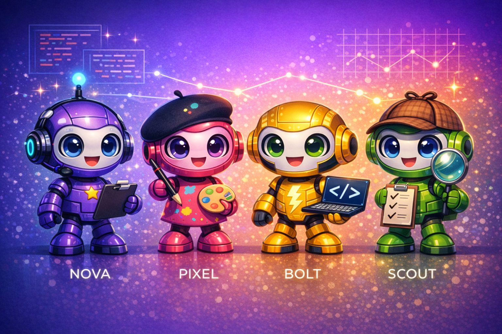

# Agent Team Logo Creator

## Cover Photo

## About This System

The Agent Team Logo Creator is a collaborative multi-agent system designed to transform the creative process of logo development into an orchestrated, intelligent workflow. The system comprises four specialized AI agents, each embodying a distinct role within a traditional design team: Nova serves as the Project Manager, coordinating tasks and ensuring alignment with client requirements; Pixel brings creative vision as the UX Designer, crafting visual concepts and iterating on aesthetic direction; Bolt operates as the Developer, translating designs into technical implementations and managing the codebase; and Scout functions as the Quality Assurance specialist, rigorously testing outputs and validating that deliverables meet established standards. These agents communicate through a shared Slack workspace, mimicking the natural collaboration patterns of human teams while leveraging the speed and consistency of AI-driven execution. The architecture enables autonomous task delegation, real-time feedback loops, and transparent progress tracking, resulting in a system that can take a logo brief from initial concept through final delivery with minimal human intervention while maintaining the creative nuance and quality control that professional design work demands.

## The Team

| Agent | Role | Specialty |
|-------|------|-----------|
| **Nova** | Project Manager | Coordination, planning, stakeholder communication |
| **Pixel** | UX Designer | Visual design, creative direction, user experience |
| **Bolt** | Developer | Technical implementation, code, automation |
| **Scout** | QA Engineer | Testing, validation, quality assurance |

## Repository

https://github.com/NinjaTech-AI/agent-team-logo-creator